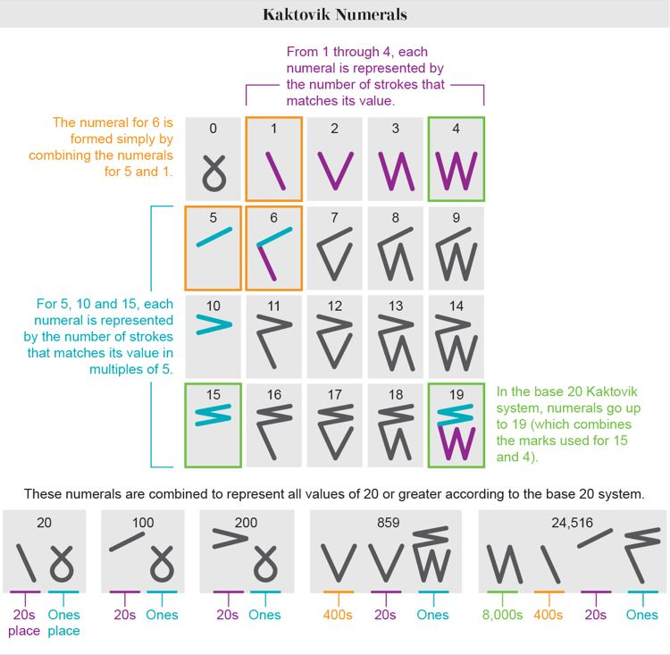

# Kaktovik numerals

- [site](https://alex-hedley.github.io/kaktovik-numerals/)

---

> The Kaktovik numerals or Kaktovik Iñupiaq numerals[1] are a base-20 system of numerical digits created by Alaskan Iñupiat. They are visually iconic, with shapes that indicate the number being represented.

- [docs](docs/README.md)
- [images](images/README.md)
- [src](src/)

## Run

- `py -m http.server`
- `python -m http.server`
- `python3 -m http.server`
