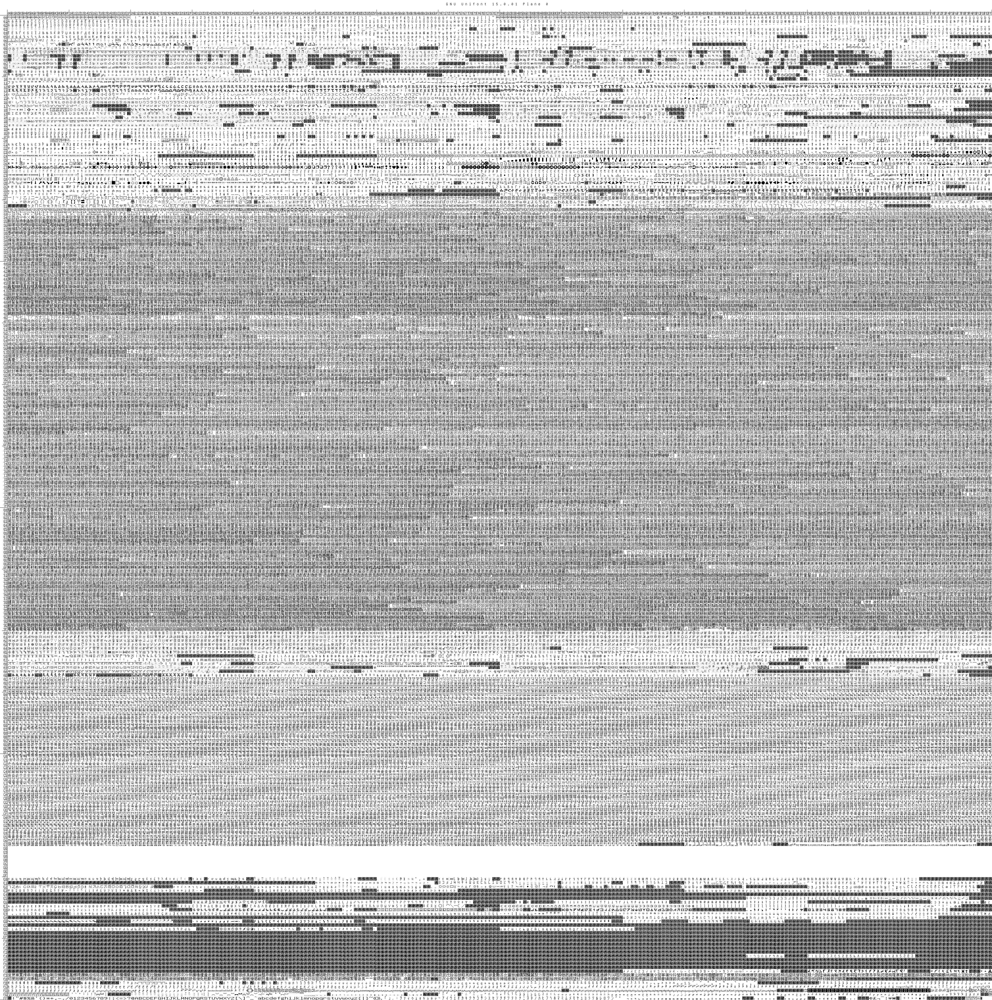
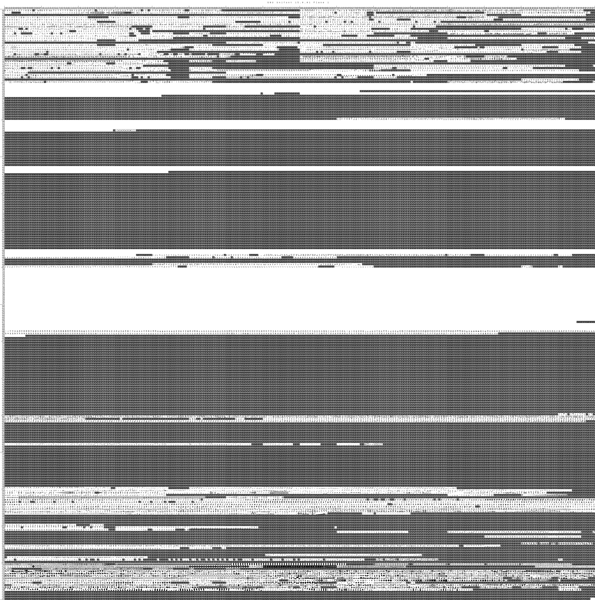

# Fonts

- [GNU Unifont Glyphs](http://unifoundry.com/unifont/)

Unifont 15.0

- 13 September 2022 (Unifont 15.0.01)
  - Unicode Plane 1
    - Paul Hardy added new glyphs in these ranges:
      - U+1D2C0..U+1D2DF Kaktovik Numerals*

*New in Unicode 15.0.0.

- http://unifoundry.com/pub/unifont/unifont-15.0.01/unifont-15.0.01.bmp

- http://unifoundry.com/pub/unifont/unifont-15.0.01/unifont_plane1-15.0.01.bmp

Font Downloads

The standard font build — with and without the ConScript Unicode Registry (CSUR) / Under-CSUR Private Use Area (PUA) glyphs. Download in your favorite format:

- OpenType:
  - The Standard Unifont OpenType Download: unifont-15.0.01.otf (5 Mbytes)
    - http://unifoundry.com/pub/unifont/unifont-15.0.01/font-builds/unifont-15.0.01.otf
    - [unifont-15.0.01.otf](unifont-15.0.01.otf)
  - Glyphs above the Unicode Basic Multilingual Plane: unifont_upper-15.0.01.otf (1 Mbyte)
    - http://unifoundry.com/pub/unifont/unifont-15.0.01/font-builds/unifont_upper-15.0.01.otf
    - [unifont_upper-15.0.01.otf](unifont_upper-15.0.01.otf)
- TrueType:
  - The Standard Unifont TTF Download: unifont-15.0.01.ttf (12 Mbytes)
    - http://unifoundry.com/pub/unifont/unifont-15.0.01/font-builds/unifont-15.0.01.ttf
    - [unifont-15.0.01.ttf](unifont-15.0.01.ttf)
  - Glyphs above the Unicode Basic Multilingual Plane: unifont_upper-15.0.01.ttf (2 Mbytes)
    - http://unifoundry.com/pub/unifont/unifont-15.0.01/font-builds/unifont_upper-15.0.01.ttf
    - [unifont_upper-15.0.01.ttf](unifont_upper-15.0.01.ttf)

---

Convert to WOFF?

- [TTF to WOFF](https://products.aspose.app/font/conversion/ttf-to-woff)

Didn't work with direct URL

local file:

- [unifont-15.0.01.woff](unifont-15.0.01.woff)

---

GS Unicode 2.0 (Plane 1)

https://fontstruct.com/fontstructions/show/2016169/gs-unicode-2-0-plane-1

.png "GS Unicode 2.0 (Plane 1)")

---
